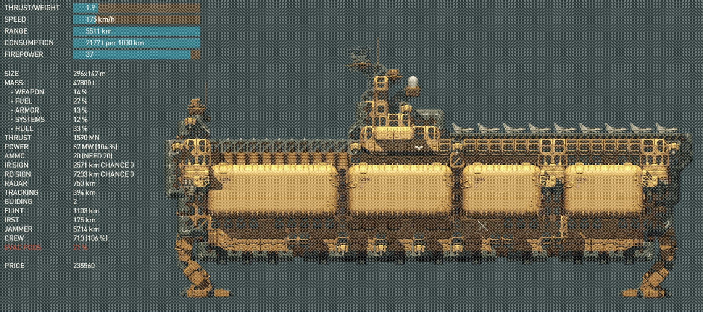

# Apocrypha-Class Strategic Command Carrier
The Apocrypha-class flagship was a direct response to rumours of the Gathering's strategic missile launcher platforms. Boasting a complement of 9 interceptors and 11 strategic missile launcher tubes, as well as a generous amount of CIWS. It has a respectable top speed of 175km/h for a ship of its size, as well as a max range of just over 5500km.
In stock configuration, it comes with 8x nuclear missiles, and 3x A-100 missiles, as well as 9 interceptors.

[NOTE]: The AAM's are placed below the flight deck and as such will require you to launch your jets prior to firing them. If you have jets on the flight deck and fire the AAM's, they will explode on the flight deck and damage your own ship as well as the jets!

- flagship
- carrier
- strategic
- tanker


```
author: Max
version: 1.0
game_version: 1.12
```
            