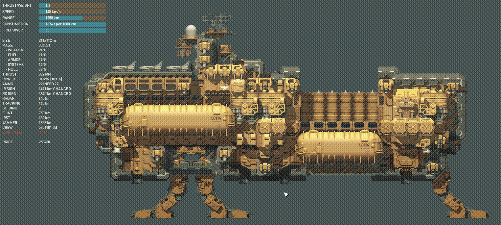

# Argo-Class Strategic Command Brawler
The Argo-class is a flexible flagship capable of acting as strategic command in the backlines - operating as light carrier and strategic missile launcher - or fighting on the frontlines as a heavily armoured and armed brawler. It can easily stand its ground against cruisers and destroyers, with full salvos being capable of cancelling out enemy fire entirely. Its main downside is its relatively low fuel capacity compared to other flagships, which means it needs supporting tanker ships to properly sustain a larger fleet.

- flagship
- carrier
- strategic


```
author: Max
version: 1.0
game_version: 1.12
```
            