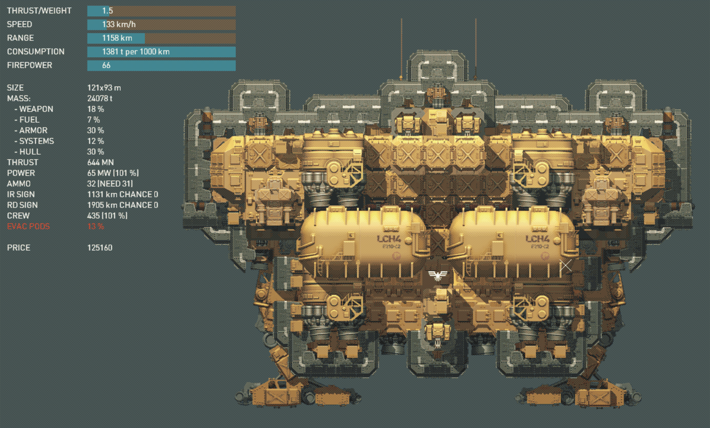

# Mjollnir-Class Heavy Brawler Cruiser
The Mjollnir-class is a heavy brawler intended for frontline deployment. Featuring an armament of two 6-180 cannons, and three missile launchers, it's capable of taking on ships of any size with great success. Additionally, it also features four Zenith missiles and three CIWS turrets that can be used offensively. Its thick top armour means it can shrug off enemy fire, while its large thrusters still ensure a commendable top speed of 133km/h.

- brawler
- heavy


```
author: Max
version: 1.0
game_version: 1.12
```
            